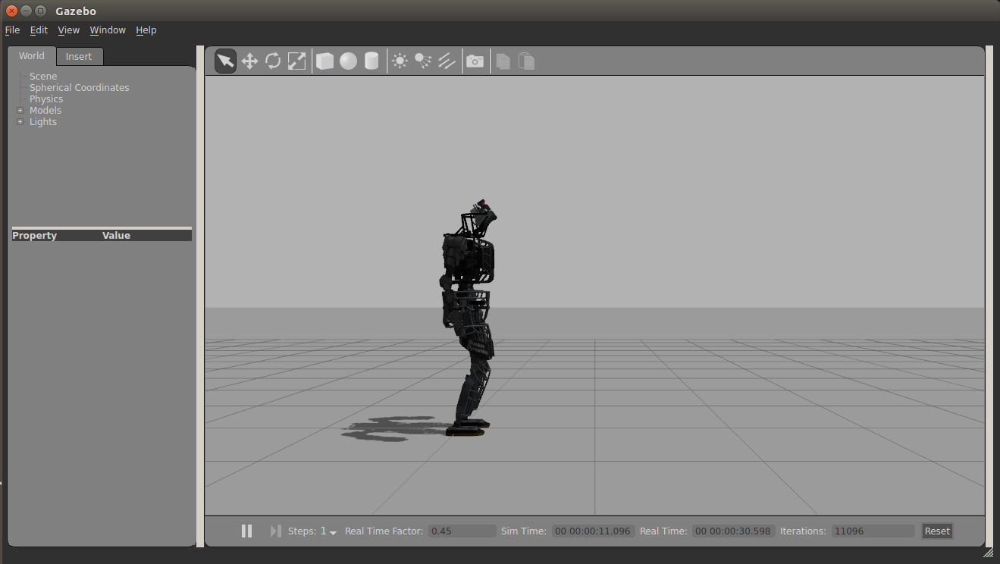

ros-drcsim 
===========

Docker image to provide DRCSim environment.
It can not be used on the nvidia driver.

Quick start
------------

Build image.

```
docker build -t ros_drcsim:1.0 .
```

Create container

```
docker run -ti --rm -e DISPLAY=$DISPLAY -v /tmp/.X11-unix:/tmp/.X11-unix --device=/dev/dri:/dev/dri ros_drcsim:1.0
```

Run atlas.launch

```
roslaunch drcsim_gazebo atlas.launch
```

The following window will be launched.


